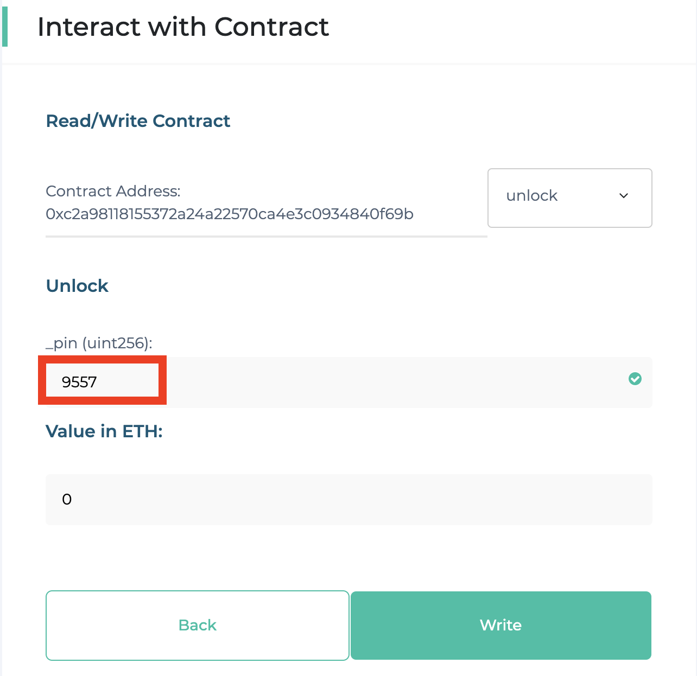
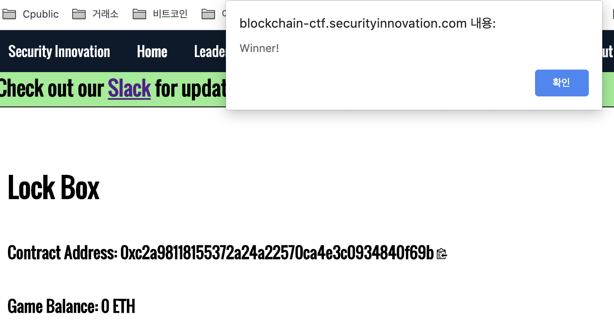

Lock Box
==
```solidity
pragma solidity 0.4.24;

import "../CtfFramework.sol";

contract Lockbox1 is CtfFramework{

    uint256 private pin; // pin을 private으로 선언해서 값을 볼수가 없다.

    constructor(address _ctfLauncher, address _player) public payable
        CtfFramework(_ctfLauncher, _player)
    {
        pin = now%10000; //생성시 now를 10000으로 나눈 나머지가 pin이 된다.
    }
    
    function unlock(uint256 _pin) external ctf{
        //해당 컨트랙트의 주소에 해당하는 블록의 timestamp를 10000으로 나눈 나머지를 대입하면 풀림
        require(pin == _pin, "Incorrect PIN");
        msg.sender.transfer(address(this).balance);
    }

}
```    
## 과정
```
block 6434494
1569119557 % 10000 = 9557
```



##결과



