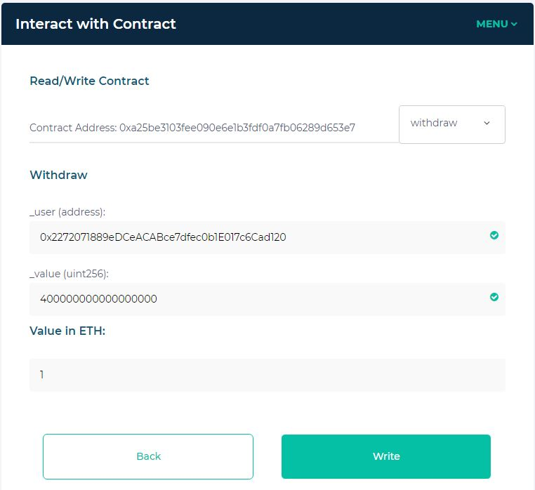

Seucre Bank
==

```solidity
pragma solidity 0.4.24;

import "../CtfFramework.sol";

contract SimpleBank is CtfFramework{

    mapping(address => uint256) public balances;

    constructor(address _ctfLauncher, address _player) public payable
        CtfFramework(_ctfLauncher, _player)
    {
        balances[msg.sender] = msg.value;
    }

    function deposit(address _user) public payable ctf{
        balances[_user] += msg.value;
    }

    function withdraw(address _user, uint256 _value) public ctf{
        require(_value<=balances[_user], "Insufficient Balance");
        balances[_user] -= _value;
        msg.sender.transfer(_value);
    }

    function () public payable ctf{
        deposit(msg.sender);
    }

}

contract MembersBank is SimpleBank{

    mapping(address => string) public members;

    constructor(address _ctfLauncher, address _player) public payable
        SimpleBank(_ctfLauncher, _player)
    {
    }

    function register(address _user, string _username) public ctf{
        members[_user] = _username;
    }

    modifier isMember(address _user){
        bytes memory username = bytes(members[_user]);
        require(username.length != 0, "Member Must First Register");
        _;
    }

    function deposit(address _user) public payable isMember(_user) ctf{
        super.deposit(_user);
    }

    function withdraw(address _user, uint256 _value) public isMember(_user) ctf{
        super.withdraw(_user, _value);
    }

}

contract SecureBank is MembersBank{

    constructor(address _ctfLauncher, address _player) public payable
        MembersBank(_ctfLauncher, _player)
    {
    }

    function deposit(address _user) public payable ctf{
        require(msg.sender == _user, "Unauthorized User");
        require(msg.value < 100 ether, "Exceeding Account Limits");
        require(msg.value >= 1 ether, "Does Not Satisfy Minimum Requirement");
        super.deposit(_user);
    }

    function withdraw(address _user, uint8 _value) public ctf{
        require(msg.sender == _user, "Unauthorized User");
        // 이 부분에서 msg.sender 를 _user 로만 검사함
        require(_value < 100, "Exceeding Account Limits");
        require(_value >= 1, "Does Not Satisfy Minimum Requirement");
        super.withdraw(_user, _value * 1 ether);
    }

    function register(address _user, string _username) public ctf{
        require(bytes(_username).length!=0, "Username Not Enough Characters");
        require(bytes(_username).length<=20, "Username Too Many Characters");
        super.register(_user, _username);
    }
}
```  

## 풀이 방법

(취약점 확인)

withdraw(address _user, uint8 _value) 함수에서

require에 msg.sender 를 _user 로만 검사하는 로직이 있음.

```solidity
function withdraw(address _user, uint8 _value) public ctf{
    require(msg.sender == _user, "Unauthorized User");

```  

(탈취 대상 확인)

컨트랙트를 최초 배포할 때, deposit 함수가 실행되는 것을 확인 할 수 있음.

즉, Contract Creater에게 일정량이 deposit 됨 (여기서는 0.4 ETH로 확인)

```solidity
contract SimpleBank is CtfFramework{
--- 생략 ---
    function () public payable ctf{
        deposit(msg.sender);
    }
}
```

> 배포된 컨트랙트 주소: [0xa25be3103fee090e6e1b3fdf0a7fb06289d653e7](https://ropsten.etherscan.io/address/0xa25be3103fee090e6e1b3fdf0a7fb06289d653e7)

> Contract Creater 주소 확인: [0x2272071889eDCeACABce7dfec0b1E017c6Cad120](https://ropsten.etherscan.io/address/0x2272071889edceacabce7dfec0b1e017c6cad120)


(탈취 시작)

* myetherwallet 이용

1) regisert 함수를 호출해서 Contract Creater의 주소로 username을 등록 (예: hack)

2) members 읽기 전용 함수를 호출해 result로 'hack'이 응답됨을 확인

3) balances 읽기 전용 함수로 Contract Creater의 주소로 보유 금액 확인 (여기서는 400000000000000000)

4) widthdarw 를 호출하여 0.4 ETH 탈취 (username이 등록되어 있으므로 require를 만족하여 아무나 빼갈 수 있음)




