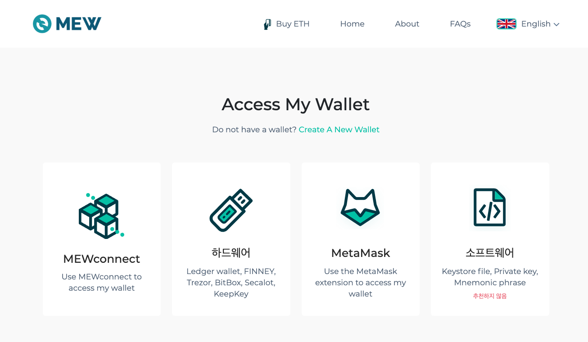

LOTTRERY
==
```solidity
function play(uint256 _seed) external payable ctf{
        require(msg.value >= 1 finney, "Insufficient Transaction Value");
        totalPot = totalPot.add(msg.value);
        bytes32 entropy = blockhash(block.number); //blockhash(block.number)는 항상 0임
        bytes32 entropy2 = keccak256(abi.encodePacked(msg.sender));
        bytes32 target = keccak256(abi.encodePacked(entropy^entropy2));
        bytes32 guess = keccak256(abi.encodePacked(_seed)); //entropy2 값을 uint256으로 변환해서 _seed에 대입
        if(guess==target){
            //winner
            uint256 payout = totalPot;
            totalPot = 0;
            msg.sender.transfer(payout);
        }
    }
```    
## 성공


